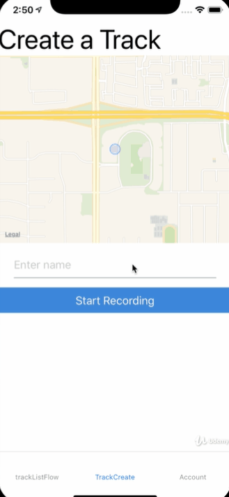

## About the Application 
 
This app is modeled as a "Fit Bit device" to track where they are going (Hiking, Running, Biking, etc.).

A user can create an account, and use the app to track there movements on a map using the google maps API.

When recording the app will draw a line indicating where the user moved.

The User can save there "tracked" path to there account and review their past movements.

## Live Demo

## Technologies Used

  * React-Native
  * Expo
  * MongoDB
  * Express.js

## API's Used

  * Google Maps 
 
 
 
## Steps to install this app

On Your Desktop:
 
1. Create a folder on your computer so you have a _designated folder_ to open the application.
 
2. Git Clone this project into your _designated folder_
 
3. Install dependencies: `npm install` 
 
 
 
## Required Supplamental Programs.

The Back-End portion of this applcation (Fit-Bitter-Server) can be found at: (https://github.com/Kennaka5/Fit-Bitter-Server.) 

Follow the readMe.md on that repository to set up the server needed to complete the application.

Ngrok wil be needed to host a live web tunnel to make calls to the Fit-Bitter-Server from your mobile device.

You can Download ngroh here: https://ngrok.com/download 
 
 
## How to run this application

1. Start up an nrgok : ngrok http 30000

    Open a teminal and input the following command: `ngrok http 30000`

    Take the Forwarding URl (Example: http://0824fab7bf32.ngrok.io)
    and paste it into \Fit-Bitter\src\api\tracker.js under the const value instance.

2. Start Up the Fit-Bitter-Server (see: Fit-Bitter-Server readMe.md)
 
3.  navigate to the root directory of your _designated folder_ and run `npm start` to run the application 

### Pull Requests Welcome!

